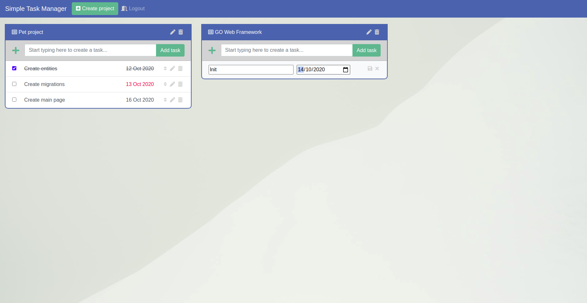

**SIMPLE TASK MANAGER**

**Setup:**
1. git clone https://github.com/petrokulybaba/simple-task-manager.git
2. docker-compose up -d
3. docker-compose exec app sh -c 'make setup'
4. docker-compose exec app sh -c 'make start'
5. Follow http://127.0.0.1:8000

**Stop server:** docker-compose exec app sh -c 'make stop'

**Tests:** docker-compose exec app sh -c 'make test'

**SQL Tasks:** [Click here](https://gist.github.com/petrokulybaba/a58ab11058877e161ddbc7b1dd9bbeec)

**Link on WEB app:** [simple-todo-task-manager.herokuapp.com](https://simple-todo-task-manager.herokuapp.com)
